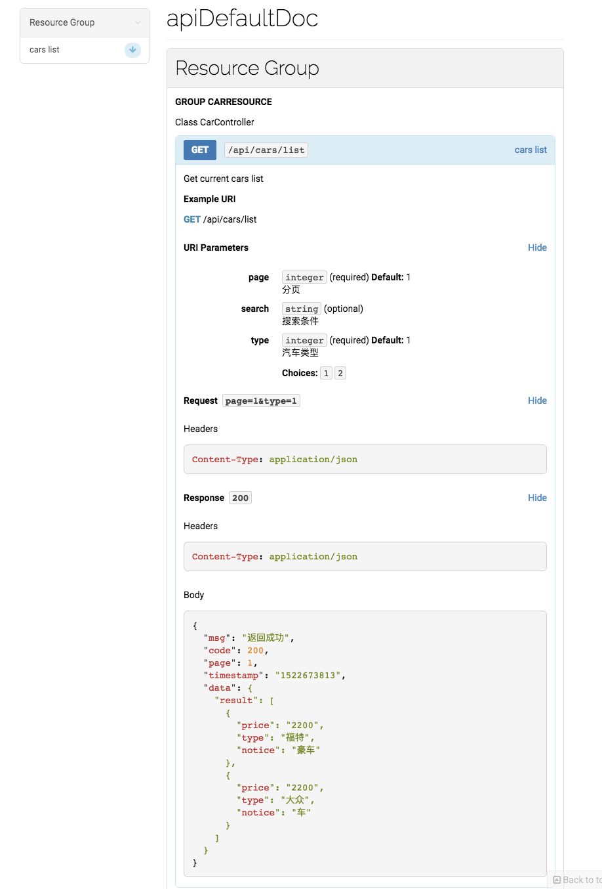

# Blueprint Generator

This package generates a valid API Blueprint 1A document from a collection of classes.

## 使用示例

Some index method phpdoc example:

```
<?php
/**
 * Class CarsController
 * @package App\Http\Controllers
 * @Resource("CarResource", uri="/api/cars")
*/
class CarsController extends Controller
{
    /**
     * cars list
     *
     * Get current cars list
     *
     * @Get("/list")
     * @Transaction({
     *      @Request(identifier="page=1&type=1"),
     *      @Response(200, body={"msg": "返回成功","code": 200,"page": 1,"timestamp": "1522673813","data":{"result":{{"price": "2200","type": "福特","notice": "豪车"},{"price": "2200","type": "大众","notice": "车"}}}})
     * })
     * @Parameters({
     *      @Parameter("page", type="integer", required=true, description="分页", default=1),
     *      @Parameter("search", type="string", required=false, description="搜索条件"),
     *      @Parameter("type", type="integer", required=true, description="汽车类型", default=1, members={
     *          @Member(value="1", description="新车"),
     *          @Member(value="2", description="旧车")
     *      })
     * })
     */
    public function index(Request $request)
    {}
}
```
如下：


## 为何制作这个？

前后端分离的工作不再是后端嵌套页面，往往的工作流程如下：

* 出接口文档
* 前端、后端同时开发
* 联调
* 自测
* 提测
* 上线

这时遇到了一个问题，那就是接口文档怎么出，目前我使用的方式经历了以下阶段：
1. 使用MarkDown出接口文档，放在共同的gitlab仓库上面，前后端都可以访问（只要约定好谁修改就好了，避免两个人都修改出现差异），作为一个经常写方法注释的好程序员来说（其实你的leader也会要求你），要在每一个接口上面写上几行方法注释，注明这个方法是做啥的，不然别人接手不便捷 ^_^；
2. 使用apiDoc工具（使用方法可以查看：[http://birjemin.com/wiki/php-apidoc](http://birjemin.com/wiki/php-apidoc)），将相应的接口规范以注释的方式写在每一个方法上面，然后生成相应的apiDoc文档（只需要写一下注释，不需要再写接口文档啦~），通过node服务搭建一个服务环境，前端直接访问我的开发机进行查看啦~
3. 使用dingo-api的Blueprint Generator，可是只能在dingo上面使用；

所以该项目的作用是将dingo-api的Blueprint Generator`剥离`出来（仅限laravel使用）。

## 为啥使用dingo-api的Blueprint Generator？
Blueprint Generator的使用方式同第二种略相似，即给每一个方法进行注释（遵循一定的规范[https://github.com/dingo/api/wiki/API-Blueprint-Documentation](https://github.com/dingo/api/wiki/API-Blueprint-Documentation)），生成apib文档。
这个时候也可以使用第一种的方式将这个文档置于某一个共有的库，前端如果需要可以使用特定的工具进行查看，比如[https://github.com/danielgtaylor/aglio](https://github.com/danielgtaylor/aglio)、`snowboard`、等等
与方法二的不同点就是该工具生成的是一个markdown文档，这个markdown文档遵循了Blueprint规范，所以和别人对接时直接给这个markdown文档就好啦~他爱用什么工具查看就什么工具~~

## 注意点

1.类的注释需要有！比如：
```
/**
 * Class CarsController
 * @package App\Http\Controllers
 * @Resource("CarResource", uri="/api/cars")
*/
```

2.注释书写方式同dingo
[https://github.com/dingo/api/wiki/API-Blueprint-Documentation](https://github.com/dingo/api/wiki/API-Blueprint-Documentation)

3.命令：

```
php artisan birjemin:docs {--name= : Name of the generated documentation}
              {--use-version= : Version of the documentation to be generated}
              {--output-file= : Output the generated documentation to a file}
              {--include-path= : Path where included documentation files are located}
```

4.示例：
* `composer require birjemin/blueprint`；
* 将`BlueprintServiceProvider::class`注册到`app.php`中；
* 写好接口注释；
* 使用下面的命令生成markdown文档：

```
php artisan birjemin:docs --output-file=tianming.apib

```

## License

This package is licensed under the [BSD 3-Clause license](http://opensource.org/licenses/BSD-3-Clause).
